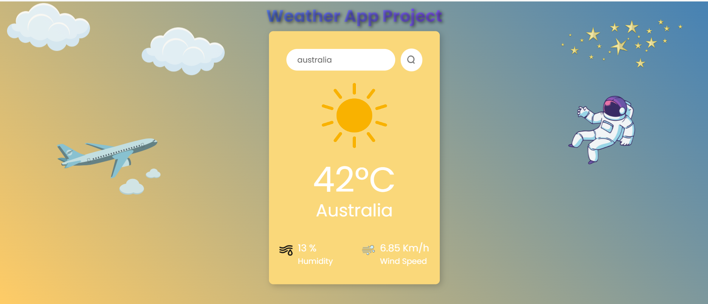

## ⛅ Weather App Project:

- A modern weather application that displays real-time weather information by using the OpenWeatherMap API.

## 😧 Features:
- 🌍 Look up any city worldwide.
- 🎨 Dynamic background changes based on weather conditions.
- 🎭 Fun animations with clouds, stars, and an astronaut.
- 📊 Displays temperature, humidity, and wind speed.

##  📸 Screenshot: 
- 

##  🌍 LIVE DEMO:
- Try it Out: https://chrisw0987.github.io/Weather-App/

## 🛠 Tech Stack:
- **Frontend:** React.js, Vite
- **Styling:** CSS, Animations
- **API:** OpenWeatherMap API
- **Tools**: GitHub, VS Code


## 📦 Installation:
1. Clone the repository:
   ```bash
   git clone https://github.com/chrisw0987/Weather-App.git
2. cd Weather-App
3. npm install
4. npm run dev
